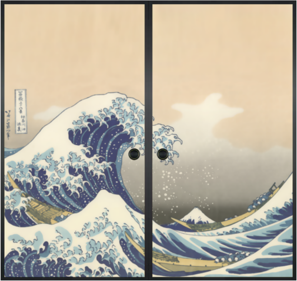

# How to make touchpad support gesture

## Step 1: setup fusuma

Go to the [fusuma website](https://github.com/iberianpig/fusuma)

one thing to note is that when you install Ruby

you may also need to install ruby-dev

## Step 2: create a config.yml file

```
mkdir ~/.config/fusuma
gedit config.yml
```

config.yml 

```
swipe:
  3:
    left:
      command: 'xdotool key super+Left' 　# View split to left
    right:
      command: 'xdotool key super+Right'  # View split to right
    up:
      command: "xdotool key super"  # show all windows
    down: 
      command: "xdotool key super+h"  # Hide current window
  4:
    up:
      command: "xdotool key super+a" # show all applications 
    down:
      command: "xdotool key super+d" # show desktop
    right:
      command: 'xdotool key ctrl+alt+Up' # To previous workspace 
    left:
      command: 'xdotool key ctrl+alt+Down' # To next workspace
pinch:
  2:
    in:
      command: 'xdotool key super+Up'
    out:
      command: 'xdotool key super+Down'
threshold:
  swipe: 0.3
  pinch: 0.1
interval:
  swipe: 1
  pinch: 1

```

## Step 3: create fusuma desktop icon

under `/usr/share/applications`, create a fusuma.desktop document:

```
[Desktop Entry]
Encoding=UTF-8
Name=fusuma
Comment=fusuma
Exec=/usr/local/bin/fusuma
Icon=/home/zhaoliang/Pictures/fusuma_icon.png
Terminal=false  #activate terminal or not when open the software, chose "false"
StartupNotify=false
Type=Application
Categories=Application;
```

the icon here you can use the following github icon:



## Step 4: setup autostart 

### Method 1: 

install a software call GNOME Tweaks, and add fusuma as:


### Method 2:

1. Check the path where you installed fusuma with `$ which fusuma`

2. Open `$ gnome-session-properties`

3. Add Fusuma and enter the location where the above path was checked in the command input field

4. Add the `-d` option at the end of the command input field as in below.

   

## Step 5: reboot your computer

